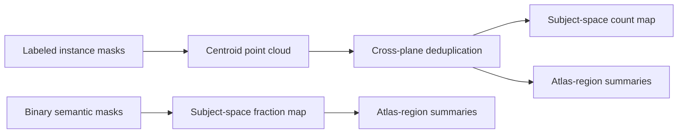

# spatialsignal

[](https://github.com/ingvildeb/spatialsignal/actions/workflows/ci.yml)
[](https://www.python.org/downloads/)
[](LICENSE)

`spatialsignal` is a Python package for turning instance and semantic
segmentations from light-sheet fluorescence microscopy into explicit,
analysis-ready spatial datasets. It builds point clouds, resolves repeated
detections across planes, creates subject-space voxel maps, and quantifies
segmented objects or signal by atlas region.

The package keeps coordinate conventions, grid geometry, data meaning, and
processing provenance alongside every canonical output. This makes spatial
tables and arrays safer to exchange between segmentation, registration, and
analysis workflows.

> [!NOTE]
> `spatialsignal` is early-stage, pre-1.0 software. The main data models and
> workflows are in place, but APIs may evolve as validation expands.

## Workflow at a glance



Current capabilities include:

- centroid extraction from labeled 2D instance-mask stacks;
- dense signal-support extraction from binary semantic masks;
- cross-plane deduplication with auditable membership and edge tables;
- exact-plane, one-to-one colocalization between centroid point clouds;
- count, density, and fractional-occupancy maps in subject space;
- atlas-region assignment and bilateral or hemisphere-aware summaries;
- area and eccentricity summaries for 2D instance detections;
- optional atlas hierarchy rollups through
  [`atlaslevels`](https://github.com/ingvildeb/atlaslevels);
- Parquet tables, NIfTI or NumPy maps, JSON metadata sidecars, and visual QC.

## Installation

`spatialsignal` requires Python 3.10 or newer. Until a PyPI release is
available, install directly from GitHub:

```bash
python -m pip install "spatialsignal @ git+https://github.com/ingvildeb/spatialsignal.git@main"
```

For local development:

```bash
git clone https://github.com/ingvildeb/spatialsignal.git
cd spatialsignal
python -m pip install -e ".[dev]"
```

## Quick start

The repository includes a self-contained example that generates a tiny mask
stack, extracts four detections, merges them into two objects, and writes a
subject-space count map:

```bash
python examples/quickstart.py --out-dir quickstart-output
```

The example creates:

```text
quickstart-output/
  masks/
  results/
    example_subject_pointcloud.parquet
    example_subject_pointcloud_space.json
    example_subject_objects.parquet
    example_subject_objects_space.json
    example_subject_object_membership.parquet
    example_subject_count_map.npy
    example_subject_count_map.nii.gz
    example_subject_count_map_space.json
```

Each computational table or map is paired with a JSON sidecar describing its
space, representation, and processing history.

## Instance-segmentation example

Each nonzero label in each input mask becomes one centroid detection:

```python
from pathlib import Path

from spatialsignal.pointcloud import build_pointcloud_from_masks

build_pointcloud_from_masks(
    mask_dir=Path("masks/subject_001"),
    out_dir=Path("outputs"),
    subject_name="subject_001",
    space_name="subject_001_native",
    orientation="las",
    resolution_um=[1.8, 1.8, 20.0],
    indexing="zero_based",
    max_workers=1,
)
```

Load the table and its sidecar together, then merge plausible detections from
adjacent planes:

```python
from spatialsignal.io import save_deduplication_outputs
from spatialsignal.models import PointCloudDataset
from spatialsignal.pointcloud import deduplicate_across_planes

dataset = PointCloudDataset.from_files(
    table_path=Path("outputs/subject_001_pointcloud.parquet"),
    json_path=Path("outputs/subject_001_pointcloud_space.json"),
)
dataset.validate()

result = deduplicate_across_planes(
    dataset.points,
    dataset.space,
    max_plane_offset=1,
    max_xy_distance_um=3.0,
    max_n_planes=2,
)
save_deduplication_outputs(dataset, result, Path("outputs"))
```

Use `max_workers=1` in notebooks and other interactive sessions. On Windows,
calls with `max_workers > 1` must run under `if __name__ == "__main__":`.

## Atlas-aware quantification

`spatialsignal` assigns cleaned objects or semantic signal to an annotation
volume already transformed into subject space. It does not perform
registration itself.

```python
from pathlib import Path

from spatialsignal.integration import (
    load_atlasspace_registration_folder,
    load_label_volume,
)
from spatialsignal.models import PointCloudDataset
from spatialsignal.quantification import quantify_objects_by_region

objects = PointCloudDataset.from_files(
    table_path=Path("outputs/subject_001_objects.parquet"),
    json_path=Path("outputs/subject_001_objects_space.json"),
)
registration = load_atlasspace_registration_folder("subject_001_registration")
annotation = load_label_volume(registration.transformed_segmentations["labels"])
hemispheres = load_label_volume(
    registration.transformed_segmentations["hemispheres"],
    space_name=annotation.space.space_name,
)

result = quantify_objects_by_region(
    objects,
    annotation,
    hemisphere=hemispheres,
    ontology_preset="allen_ccfv3",
    region_id_space="allen",
    output_csv=Path("outputs/subject_001_region_summary.csv"),
)
```

The annotation supplies region identities; an optional hemisphere volume adds
left, right, and bilateral measurements. Hemisphere IDs follow the BrainGlobe
convention: `1 = left` and `2 = right`.

The registration-folder loader consumes the public manifest contract produced
by [`atlasspace`](https://github.com/ingvildeb/atlasspace). Direct NIfTI loading
also works when no registration folder is available.

## Spatial data contract

Coordinates and in-memory arrays use `x, y, z` axis order. A
`SpaceDefinition` records:

- anatomical orientation, such as `las`;
- axis labels and zero- or one-based indexing;
- grid shape and voxel resolution in microns;
- a human-readable space name.

`DatasetMetadata` adds the representation type and processing provenance.
Canonical JSON sidecars are part of the dataset rather than optional notes.
Point tables should not be interpreted without their matching sidecars.

Subject-space outputs are the quantitative source of truth. Reference-space
maps may be derived for visualization and cross-subject comparison, while
regional quantification samples an atlas annotation transformed into each
subject's space.

See [Coordinate systems](docs/coordinate_systems.md) for the complete axis,
indexing, remapping, and NIfTI conventions.

## Outputs

| Representation | Primary format | Meaning |
| --- | --- | --- |
| Raw detections | Parquet + JSON | One centroid per labeled 2D instance |
| Cleaned objects | Parquet + JSON | Cross-plane detections merged into objects |
| Signal points | Parquet + JSON | Foreground voxels from semantic masks |
| Count or density map | NIfTI/NumPy + JSON | Instance-derived values on an analysis grid |
| Fraction map | NIfTI/NumPy + JSON | Semantic occupancy on an analysis grid |
| Region summary | CSV | Atlas-enriched regional measurements |

Large computational tables use Parquet to preserve data types and support
efficient reads. Compact regional summaries remain CSV for straightforward
inspection.

## Examples and documentation

Runnable examples under `examples/` cover:

- point-cloud and signal-point construction;
- cross-plane deduplication and its pairwise QC;
- point-cloud colocalization;
- point and semantic-mask voxelization;
- atlas-region quantification;
- config scaffolding and legacy-output validation.

Detailed guides:

- [Workflows](docs/workflow.md): supported pipelines and package boundaries
- [Coordinate systems](docs/coordinate_systems.md): spatial and map conventions
- [Legacy MATLAB relationship](docs/legacy_matlab_relationship.md): optional compatibility notes
- [Roadmap](docs/roadmap.md): completed work and planned research lanes
- [Contributing](CONTRIBUTING.md): development setup and pull-request guidance

## Ecosystem scope

`spatialsignal` is designed to interoperate with focused packages in the LSFM
analysis ecosystem:

- `atlasspace` owns registration, transforms, and registration outputs;
- `atlaslevels` owns atlas ontologies, hierarchy definitions, and ID mapping;
- `spatialsignal` owns segmentation-derived point datasets, voxel maps, and
  subject-space quantification.

Keeping these responsibilities separate prevents project-specific
orchestration from becoming part of the reusable spatial API.

## Development

Install the development dependencies and run the test suite:

```bash
python -m pip install -e ".[dev]"
python -m pytest -q
python -m build
```

See [CONTRIBUTING.md](CONTRIBUTING.md) before proposing a substantial change.

## Citation

If you use `spatialsignal` in research, cite the software using the metadata in
[`CITATION.cff`](CITATION.cff). Citation metadata can be expanded with a DOI
after the first archived release.

## License

`spatialsignal` is distributed under the
[GNU General Public License v3.0](LICENSE) (`GPL-3.0-only`).
